# HEI FastAPI


面向中后台与通用业务的全栈脚手架：FastAPI 异步后端 + Vue 3 管理端 + React 门户 + uni-app 管理端。

业务模块通过 `ModuleSpec` 插件式装配；内置 IAM/RBAC、系统配置、文件存储、消息、代码生成、SnailJob 定时任务与 Alembic 迁移。

> 个人开发，有 bug 欢迎提：jiangbytebiz@163.com

---

## 仓库结构

```text
app/                 后端（core / deps / middleware / modules / platform / worker）
docs/screenshots/    README 界面截图（admin / portal）
migrations/          Alembic 迁移
scripts/db/          迁移脚本（migrate / makemigration / check）
tests/               后端测试
web/
  admin/             Vue 3 管理端（Naive UI）
  portal/            React 19 门户（Ant Design）
  admin-uniapp/      uni-app 管理端（H5 / 小程序）
docker-compose.yml   后端 + 可选 admin / portal profile
entrypoint.sh        all | api | worker | migrate
```

---

## 技术栈

| 类别 | 技术 |
|---|---|
| 后端 | FastAPI / SQLAlchemy 2 Async / Pydantic v2 / Gunicorn / Uvicorn |
| 数据 | PostgreSQL / Redis；可选 MySQL、SQLite extras |
| 任务 | SnailJob（外部 Server + snail-job-python 执行器） |
| 存储 | Local / MinIO / RustFS / S3 / OSS（`sys_config` 维护） |
| 管理端 | Vue 3 / Naive UI / Vite / TypeScript / UnoCSS |
| 门户端 | React 19 / Ant Design 6 / Vite / TypeScript / UnoCSS |
| 移动端 | uni-app 3 / Vue 3 / Pinia / uview-pro |

---

## 功能概览

- **权限**：账号、角色、部门、用户组、岗位、资源菜单、数据范围
- **会话**：Web 使用 HttpOnly Cookie；uni-app 使用本地 Authorization token
- **系统**：字典、配置（`sys_config`）、文件、Banner、审计、代码生成、弱口令
- **消息**：通知、公告、反馈
- **前端**：Admin 动态菜单；Portal 登录/注册、公告、反馈、个人中心；uni-app 管理端能力

API 前缀 `/api`，完整路径写在路由上（如 `/v1/admin/...`、`/v1/portal/...`）。

HTTP JSON：**标量均为字符串**（含 `code`、分页字段、业务 bool/int）。

---

## 界面预览

### 管理端（Admin）

| 登录 | 运营工作台 |
|:---:|:---:|
| 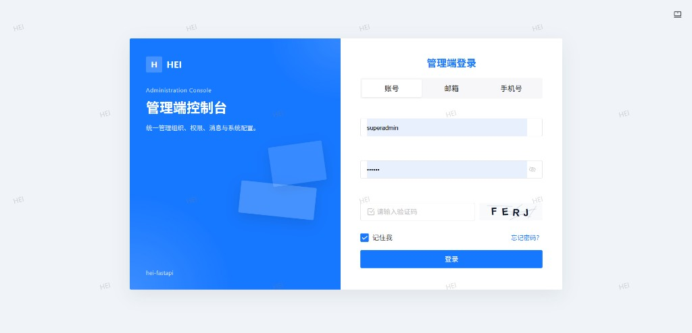 |  |

| 账号管理 | 资源管理 |
|:---:|:---:|
| 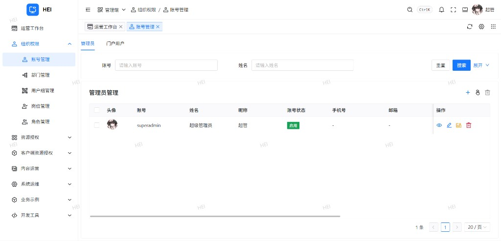 | 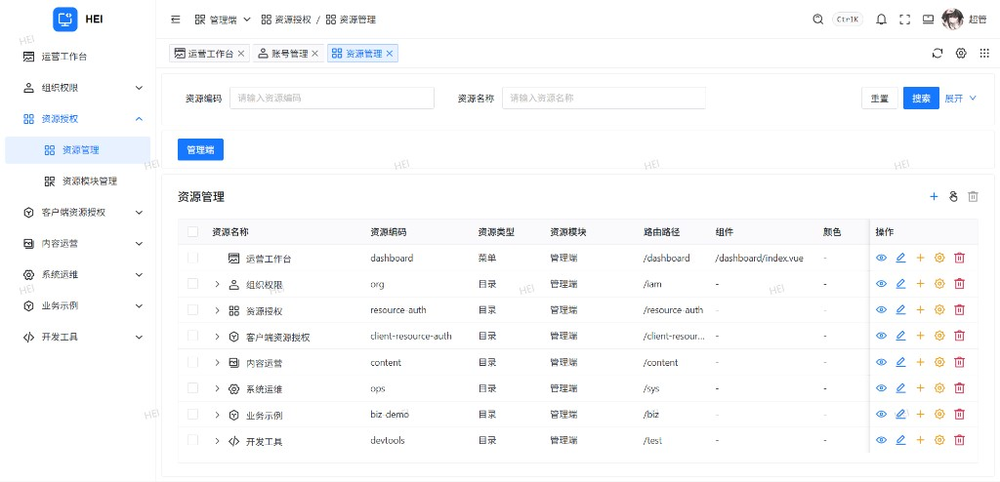 |

| 展示图管理 | 在线会话 |
|:---:|:---:|
| 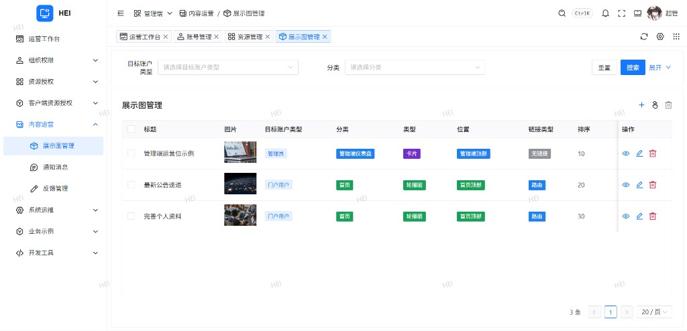 | 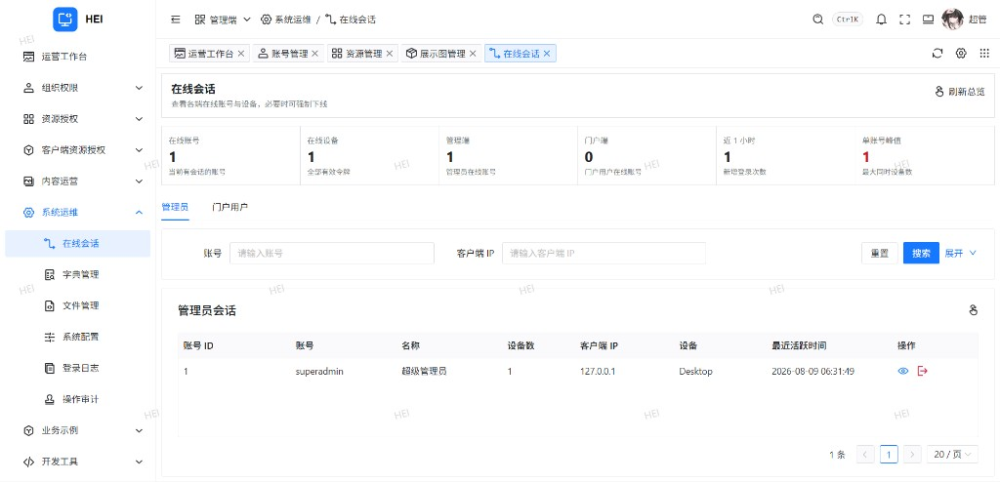 |

| 字典管理 | 系统配置 |
|:---:|:---:|
| 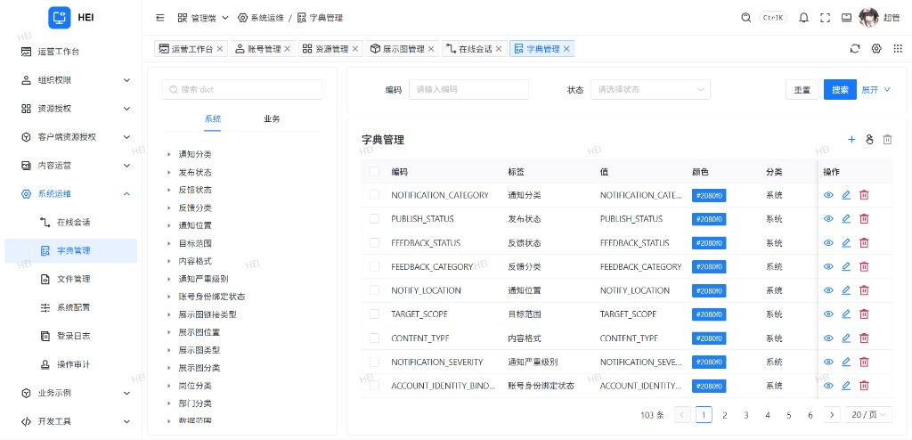 | 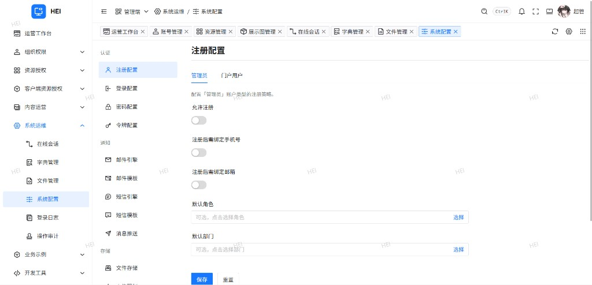 |

| 登录日志 | 编辑器测试 |
|:---:|:---:|
| 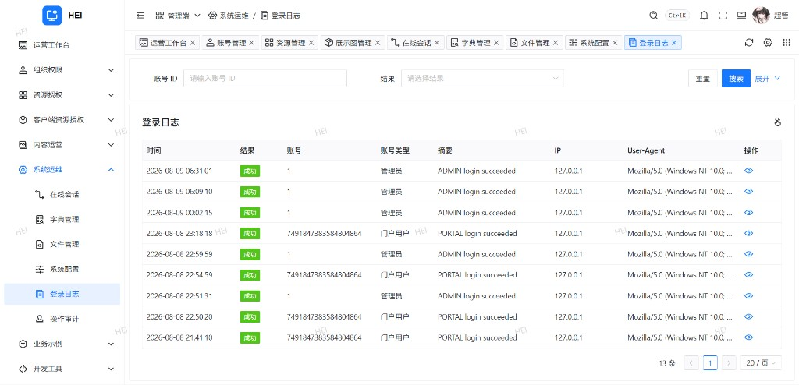 | 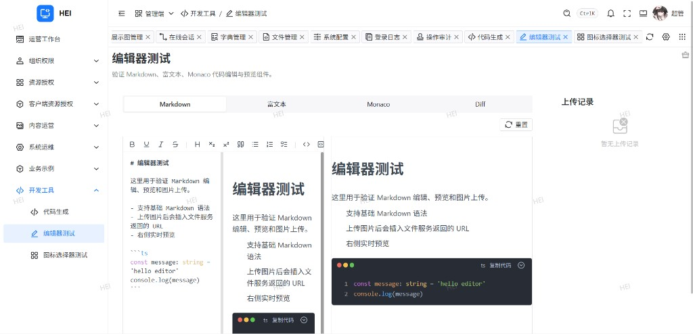 |

### 门户端（Portal）

| 首页 | 登录弹窗 |
|:---:|:---:|
|  |  |

| 个人主页 | 公开资料 |
|:---:|:---:|
| 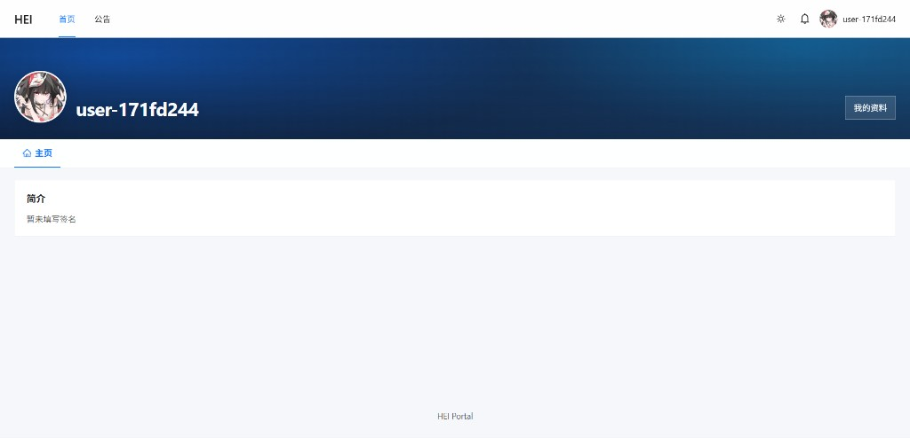 | 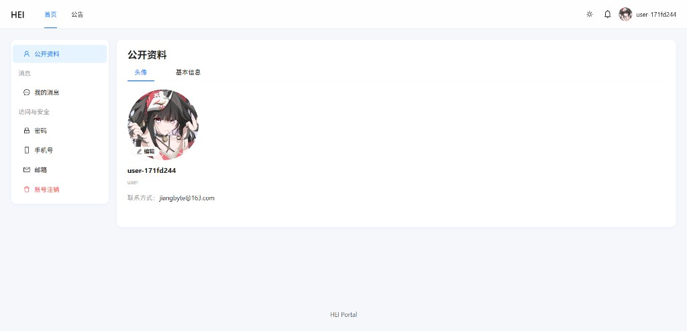 |

| 账号注销 |
|:---:|
| 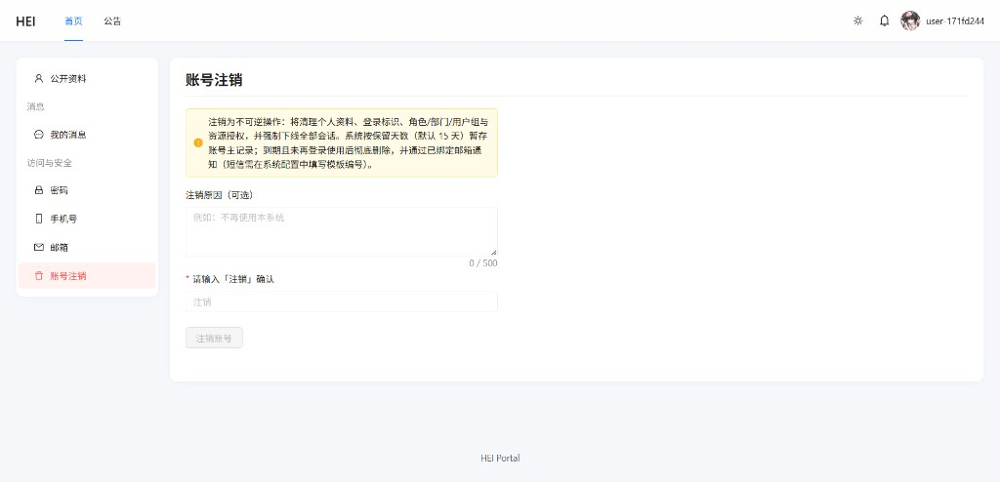 |

---

## 快速开始

### 1. 基础设施

准备 PostgreSQL 与 Redis（可用 `./dev.sh` 启动本地 `dev-postgres` / `dev-redis` / `dev-rustfs` 等容器）。

### 2. 后端

```bash
python -m venv .venv
source .venv/bin/activate          # Windows: .venv\Scripts\activate
pip install -e ".[dev,postgres]"

cp .env.example .env
# 配置 DB__URL、REDIS__URL、SNAIL_JOB__*
# 生产还需 APP__CONFIG_CRYPTO_KEY

python scripts/db/migrate.py
./entrypoint.sh
```

- API：`http://127.0.0.1:8000`
- 文档：`http://127.0.0.1:8000/docs`
- 其它角色：`./entrypoint.sh api|worker|migrate`

### SnailJob 执行器（外部 Server）

本仓库只跑 Python 执行器；调度中心需自行部署。在 Server 控制台创建组（与 `SNAIL_JOB__GROUP_NAME` / token / namespace 一致），并为下列执行器建定时任务（执行器类型 **Python**、任务类型 **集群**）：

| 执行器名 | 建议周期 | 说明 |
|---|---|---|
| `sysFileCleanupLocalOrphans` | 3600s | 清理本地存储孤儿文件 |
| `accountPurgeCancelledAccounts` | 86400s | 清理过期注销账户 |
| `bannerFlushInteractions` | 300s | Banner 交互增量刷库 |
| `auditAnalysisCycle` | 300s（或按 `AUDIT_ALERT` 配置） | 审计告警分析 |

启动 worker 后，控制台应能看到 `py-xxxxxxx` 客户端上线。审计分析周期请在 SnailJob 控制台调整（不再支持配置热更新改 beat）。

### 3. 管理端

```bash
cd web/admin && pnpm install && pnpm dev
```

`http://127.0.0.1:5173` · [说明](web/admin/README.md)

### 4. 门户端

```bash
cd web/portal && pnpm install && pnpm dev
```

`http://127.0.0.1:5174` · [说明](web/portal/README.md)

### 5. uni-app 管理端

```bash
cd web/admin-uniapp && pnpm install && pnpm dev:h5
```

默认端口见其 `.env` · [说明](web/admin-uniapp/README.md)

---

## 配置

| 位置 | 内容 |
|---|---|
| `.env` | 监听、DB、Redis、SnailJob、CORS、加密 key 等 |
| `sys_config` | 运行态业务配置：`AUTH_*` / `MAIL_*` / `SMS_*` / `STORAGE_*` 等 |

配置变更后当前进程立即重载，其它实例经 Redis 订阅刷新。

模块开关：

```bash
HEI_MODULE_PACKAGES=your_company.modules
HEI_DISABLED_MODULES=biz.cg_test_activity
HEI_ENABLED_MODULES=some.module
```

禁用模块的模型仍参与 Alembic metadata，可正常迁表。

---

## 新增业务模块

1. 在 `app/modules/...` 增加 `model` / `schema` / `repository` / `service` / `router` / `module.py`
2. 配置 `ModuleSpec` 与 `RouteSpec`，路径含 `/v1/admin|portal/...`
3. `python scripts/db/makemigration.py "..."` → `python scripts/db/migrate.py`
4. Admin 使用动态路由时，在 DB 写入资源并授权即可

业务代码放在模块内，避免改动 `app/factory.py`、`app/lifespan.py`。

---

## Docker

```bash
docker compose run --rm hei migrate
docker compose up -d --build

# 同时启动前端
docker compose --profile admin --profile portal up -d --build
```

| 服务 | 默认端口 |
|---|---|
| 后端 | `8000`（`BACKEND_PORT`） |
| Admin | `8081`（`ADMIN_PORT`） |
| Portal | `8082`（`PORTAL_PORT`） |

```bash
docker build -t hei-fastapi-admin web/admin
docker run -d -e BACKEND_URL="http://host.docker.internal:8000" -p 8081:81 hei-fastapi-admin

docker build -t hei-fastapi-portal web/portal
docker run -d -e BACKEND_URL="http://host.docker.internal:8000" -p 8082:80 hei-fastapi-portal
```

---

## 常用命令

```bash
python scripts/db/makemigration.py "describe schema change"
python scripts/db/check_migration.py
python scripts/db/migrate.py

python -m ruff check app tests
python -m pytest

# 在对应 web/* 目录
pnpm dev && pnpm build && pnpm lint
```

- [scripts/README.md](scripts/README.md)
- [migrations/README.md](migrations/README.md)
- [web/admin/README.md](web/admin/README.md)
- [web/portal/README.md](web/portal/README.md)
- [web/admin-uniapp/README.md](web/admin-uniapp/README.md)

---

## License

MIT · [LICENSE](LICENSE)
